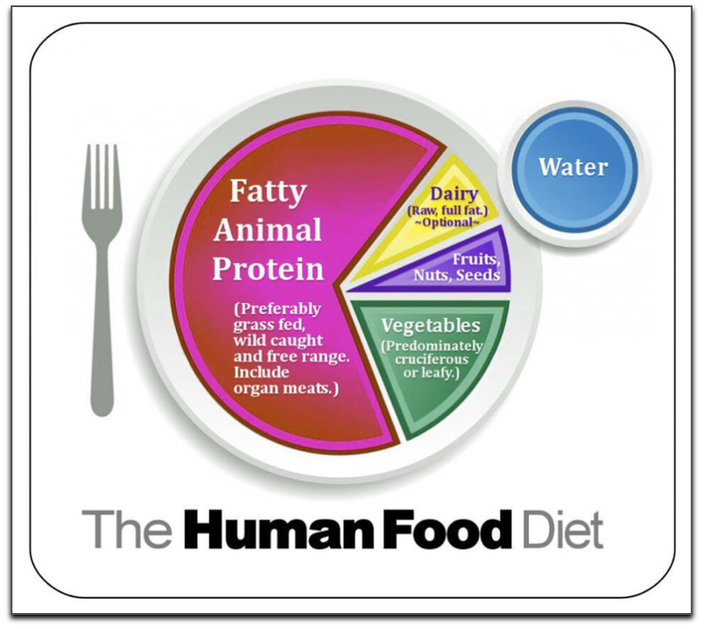

# Health and Nutrition

**Eat**
1. Meat on bone
1. Animal Products
1. Fresh Veggies

**Avoid**
1. Refined Carbs
1. Sugar
1. Seed oils

##### Resources

1. [Nutrition and Physical Degredation - WESTON A. PRICE](http://gutenberg.net.au/ebooks02/0200251h.html)
1. Deep Nutrition - Cate Shanahan
1. Good Calories, Bad Calorie - Gary Taub
1. Big Fat Surprise - Nina Teicholz
1. [strong medicine](strong-medicine-blake-donaldson.pdf)
1. [fat of the land](the-fat-of-the-land-vilhjalmur-stefansson.pdf)
1. [stone age diet](the-stone-age-diet-walter-l-voegtlin.pdf)
1. [5 Rules of Slow Carb Diet](slow-carb-diet-5-rules.md)
1. [foods](slow_carb_foods.md)

## Workouts

**Basic Movements**

1. Push
1. Pull
1. Squat
1. Hip hinge
1. Carry

**Workout Programs**

1. [70s program](70s-bulk.md)
1. [Skinny Fat](ajac_skinny_fat.md)
1. [High Frequency](high-frequency-program.md)
1. [Young Dudes](young-person-workout-routine-3m.md)
1. [Ass](Ass-workout.md)
1. [Forearm growth](bicep-forearm-growth.md)

##### Resources

[Daily Yoga](https://www.youtube.com/watch?v=RhbtJn9vcyc&list=PLRysCgw7PeiEqppXyRc6Y2EmM37ZioZeP)

[Sauna](Sauna-benefits.md)

[Health Metrics (Men)](Health-metrics.md)

[Aging](Aging.md)

[Perfect Posture](perfect-posture.md)

[Body types](bodytypes.md)

